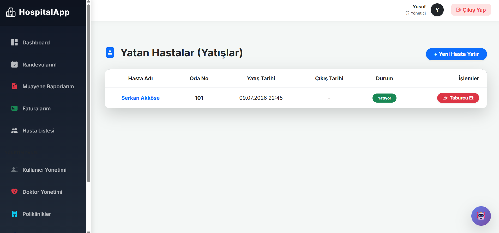
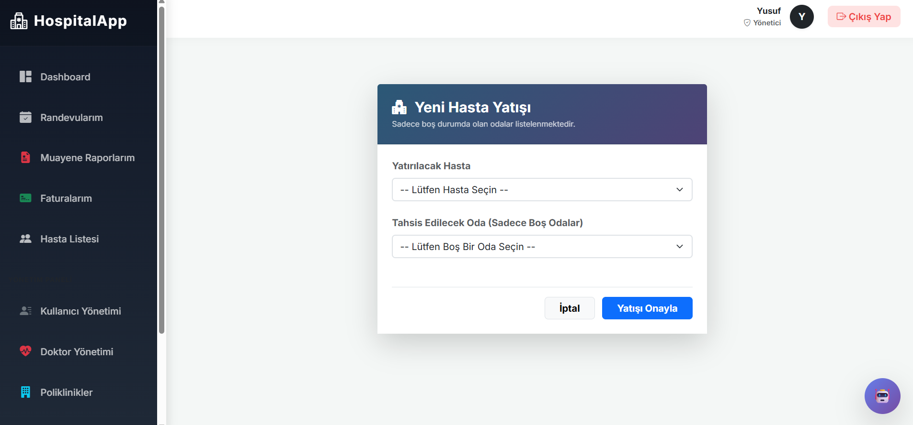
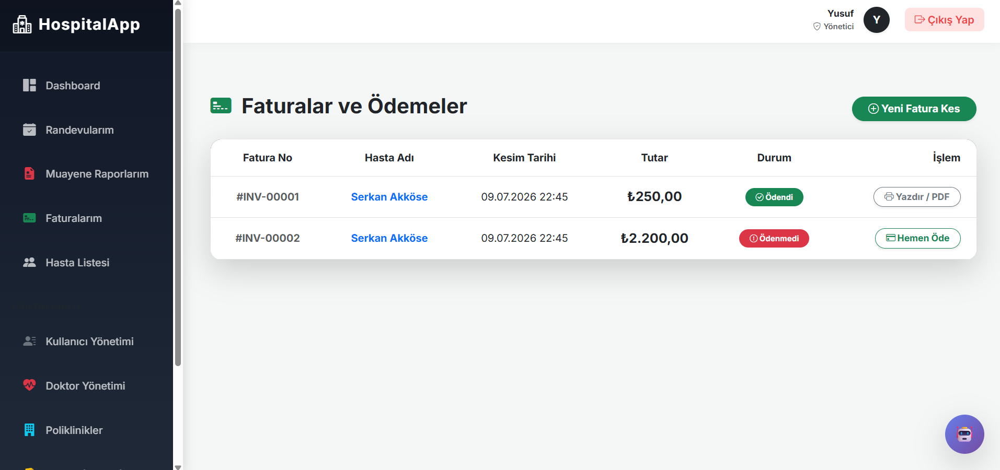
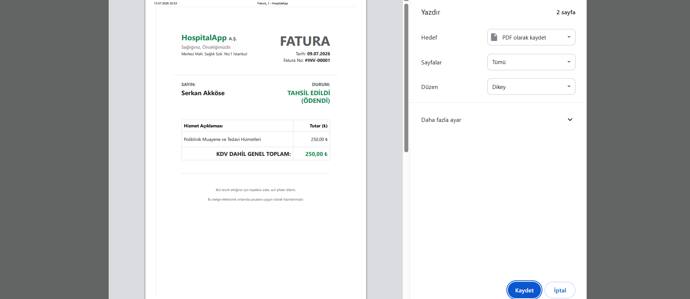
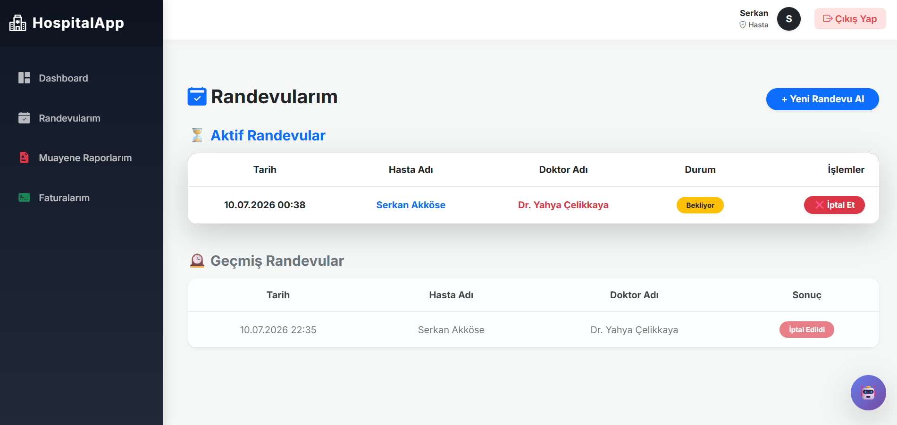
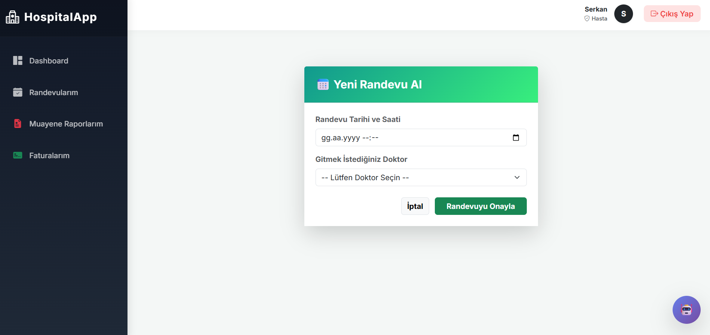
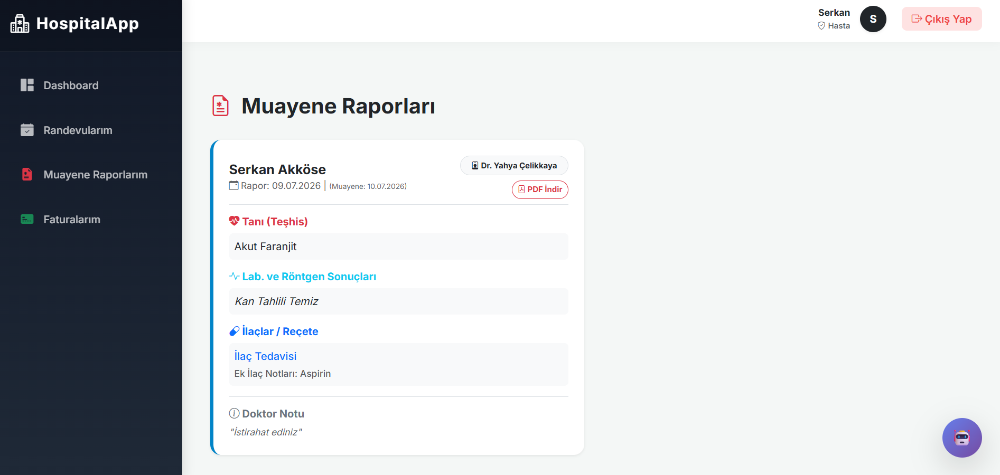
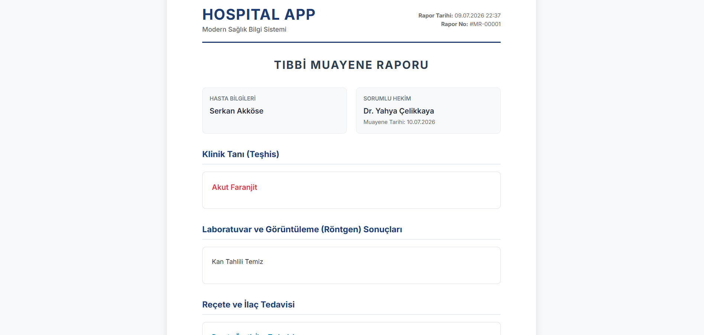
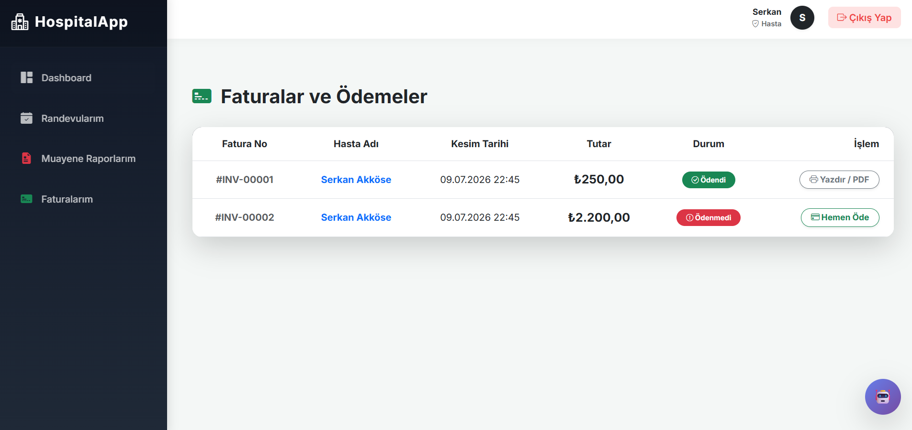

<div align="center">

# 🏥 HASTANE YÖNETİM SİSTEMİ 🩺

[](https://dotnet.microsoft.com/)
[]()
[]()
[]()

<p align="center">
  <b>Modern, ölçeklenebilir ve güvenli hastane ve sağlık kurumu otomasyon yazılımı.</b><br>
  <i>SoftITo 2026 Backend Bitirme Projesi</i>
</p>

</div>

---

## 📋 İÇİNDEKİLER

- [🎯 Proje Hakkında](#-proje-hakkında)
- [✨ Detaylı Özellikler](#-detaylı-özellikler)
- [🛠 Kullanılan Teknolojiler](#-kullanılan-teknolojiler)
- [💻 Sistem Gereksinimleri](#-sistem-gereksinimleri)
- [🚀 Kurulum Adımları](#-kurulum-adımları)
- [🗂️ Proje Mimarisi](#️-proje-mimarisi)

---

## 🎯 PROJE HAKKINDA

**Hastane Yönetim Sistemi**, hastane operasyonlarını (hasta kayıt, doktor atama, randevu vb.) dijitalleştirmek amacıyla geliştirilmiş uçtan uca bir yazılım çözümüdür. Arka planda yüksek performanslı bir **RESTful Web API** koşarken, ön tarafta **ASP.NET Core MVC** kullanılarak kullanıcı dostu bir arayüz tasarlanmıştır.

Bu sistem sayesinde sağlık kurumları:

- 🏥 **Hasta ve doktor bilgilerini** tek bir merkezden yönetebilir,
- 🔐 **JWT tabanlı kimlik doğrulama** ile güvenli erişim sağlayabilir,
- ⚡ **Yüksek performanslı altyapı** sayesinde işlemleri kesintisiz gerçekleştirebilir.

Proje, kurumsal mimari standartlarına ve temiz kod (Clean Code) prensiplerine uygun olarak geliştirilmiş olup, kritik sorgularda performansı artırmak için Stored Procedure ve Micro-ORM araçları içermektedir.

> **Not:** Bu proje, **SoftITo 2026 Backend Bitirme Projesi** kapsamında tasarlanmış ve geliştirilmiştir.

---

## ✨ DETAYLI ÖZELLİKLER

Sistem, sağlık kurumu işleyişini kolaylaştıran temel modüllerden oluşur:

### 👥 1. Hasta & Doktor Yönetimi
- 📝 **Hasta Kaydı:** Sisteme yeni hasta bilgilerinin eklenmesi ve düzenlenmesi.
- 👨‍⚕️ **Doktor Yönetimi:** İlgili branşlara doktor atanması ve takibi.

### 🔐 2. Güvenlik & Yetkilendirme
- 🛡️ **JWT Entegrasyonu:** Güvenli oturum yönetimi ve bulut tabanlı kimlik doğrulama.
- 🔑 **Azure SDK:** Bulut hizmetleriyle entegre güvenlik çözümleri.

### âš¡ 3. Performans Optimizasyonu
- 🚀 **Stored Procedures:** Kritik veritabanı işlemlerinde (CRUD) yanıt sürelerinin maksimize edilmesi.
- 🔄 **Micro-ORM:** İhtiyaç duyulan noktalarda Dapper kullanılarak yüksek hızlı veri çekimi.

### 🌐 4. Uçtan Uca Haberleşme
- 🔌 **API İstemcisi:** MVC arayüzünün `HttpClient` kullanarak Web API'den kesintisiz veri alıp vermesi.
- 📄 **Dökümantasyon:** Tüm servis uç noktalarının **Swagger (OpenAPI)** ile test edilebilir formata getirilmesi.

---

## 🛠 KULLANILAN TEKNOLOJİLER

Projenin altyapısında sektör standartlarına uygun, modern teknolojiler kullanılmıştır:

| Kategori | Teknoloji / Araç | Detay |
|---|---|---|
| ⚙️ **Backend** | `C# 12`, `.NET 8.0` | Güçlü, güvenli ve performanslı sunucu tarafı. |
| 🌐 **API & Arayüz** | `ASP.NET Core Web API`, `MVC` | RESTful servisler ve kullanıcı dostu arayüz. |
| 🗄️ **Veri Yönetimi** | `MS SQL Server`, `EF Core`, `Dapper` | İlişkisel veritabanı ve ORM yaklaşımları. |
| 🔒 **Güvenlik** | `JWT (JSON Web Token)`, `Azure SDK` | Modern kimlik doğrulama standartları. |
| 🧩 **Araçlar** | `Swagger`, `HttpClient`, `Git` | API dökümantasyonu ve versiyonlama. |

---

## 💻 SİSTEM GEREKSİNİMLERİ

Projeyi sorunsuz çalıştırabilmeniz için geliştirme ortamınızda bulunması gerekenler:

- 🟩 **.NET 8.0 SDK**
- 🗄️ **MS SQL Server** (LocalDB veya standart kurulum)
- 💻 **IDE:** Visual Studio 2022 (Tavsiye edilen) veya Visual Studio Code.

---

## 🚀 KURULUM ADIMLARI

Projeyi kendi bilgisayarınızda çalıştırmak için aşağıdaki adımları sırasıyla takip ediniz:

### Adım 1: Projeyi Klonlayın

```bash
git clone https://github.com/Ysfcelikkaya/Bitirme_Projesi.git
cd Bitirme_Projesi/HospitalApp
```

### Adım 2: Veritabanı Bağlantısını Ayarlayın
`appsettings.json` dosyalarındaki `ConnectionStrings:Default` bölümünün yerel SQL Server ayarlarınıza uygun olduğundan emin olun.

### Adım 3: Bağımlılıkları Yükleyin ve Derleyin

Projeyi derlemek için terminalde aşağıdaki komutu çalıştırın:

```bash
dotnet build
```

### Adım 4: Projeyi Çalıştırın

Önce API projesini, ardından MVC projesini çalıştırın:

```bash
# API projesi için
cd HospitalAppApi/HospitalAppApi
dotnet run

# Yeni bir terminalde MVC projesi için
cd ../../HospitalAppMvc/HospitalAppMvc
dotnet run
```

Tarayıcınız üzerinden MVC uygulamasına veya Swagger dökümantasyon sayfasına (API portu üzerinden) ulaşabilirsiniz.

---

## 🗂️ PROJE MİMARİSİ (Çok Katmanlı Yapı)

Proje dizin yapısı, anlaşılabilirlik ve sürdürülebilirlik açısından Çok Katmanlı (N-Tier) standartlarına uygun olarak tasarlanmıştır:

```text
📂 HospitalApp
├── 📁 HospitalAppApi/    # RESTful servislerin barındırıldığı backend katmanı
├── 📁 HospitalAppMvc/    # Web API ile haberleşen son kullanıcı arayüz katmanı
└── 📁 HospitalAppDppr/   # Dapper (Micro-ORM) ile veri erişimi yapılan katman
```

---

## 📸 EKRAN GÖRÜNTÜLERİ

### 🌐 MVC Ön Yüz (Kullanıcı Arayüzü)

**1. Ana Karşılama Ekranı**

*Hastaların sisteme giriş yapabileceği, kayıt olabileceği ve e-randevu ekranlarına yönlendirildiği modern ana sayfa.*

**2. Kullanıcı Kayıt Ekranı**

*Sisteme ilk defa giriş yapacak hastalar için hazırlanmış kullanıcı dostu kayıt olma sayfası.*

**3. Şifre Yenileme Ekranı**

*Kullanıcıların unuttukları şifreleri güvenli bir şekilde sıfırlayabildikleri şifre yenileme sayfası.*

**4. Yönetim Paneli (Admin Dashboard)**

*Hastane yöneticileri ve doktorlar için tasarlanmış; istatistiklerin, randevuların ve gelirlerin takip edildiği kapsamlı kontrol paneli.*

**5. Semptom Kontrol Botu (Akıllı Yönlendirme)**

*Hastaların şikayetlerini dinleyip onları doğru polikliniğe (Örn: Göz Hastalıkları) yönlendiren yenilikçi asistan modülü.*

**6. Muayene ve Reçete Ekranı (Doktor Paneli)**

*Doktorların hastalar için tanı koyduğu, reçete yazdığı ve tahlil sonuçlarını sisteme girdiği kapsamlı muayene kayıt ekranı.*

**7. Yeni Fatura Kesme Ä°ÅŸlemi**

*Hastaların ayakta (randevulu) veya yatarak (oda yatışlı) tedavileri için detaylı faturalandırma ve ödeme yönetim ekranı.*

**8. Yeni Doktor ve Poliklinik Tanımlama**

*Sisteme yeni uzman hekimlerin unvan, poliklinik ve hesap bilgileriyle birlikte eklendiği yetkilendirme sayfası.*

**9. Randevularım Listesi**

*Geçmiş ve aktif randevuların durumlarının takip edilip iptal/tamamlama işlemlerinin yapıldığı liste.*

**10. Yeni Randevu Alma Ekranı**

*Poliklinik ve doktora göre saat/tarih seçilerek anında randevu oluşturulan panel.*

**11. Detaylı Muayene Raporu**

*Hastanın aldığı tanı, ilaçlar, laboratuvar sonuçları ve doktor notlarının bulunduğu PDF/çıktı alınabilir rapor.*

**12. Faturalar ve Ödemeler Listesi**

*Geçmiş faturaların, tutarların ve ödeme durumlarının (Ödendi/Ödenmedi) listelendiği ekran.*

**13. Hasta Listesi ve Yönetimi**

*Kayıtlı hastaların filtrelenebildiği, excel/pdf olarak indirilebildiği yönetim paneli listesi.*

**14. Hasta Profil Tanımlama Ekranı**

*Yeni hastaların T.C. Kimlik, kan grubu ve iletişim bilgileriyle sisteme kaydedildiği detaylı form.*

**15. Dinamik PDF Rapor Çıktısı**

*Sistem üzerinden anlık olarak oluşturulan kurumsal PDF dökümleri (Hasta raporu, fatura vb).*

**16. Sistem Kullanıcıları ve Yetkilendirme**

*Yönetici, Doktor ve Hasta rollerine sahip tüm kullanıcıların yönetildiği merkezi liste.*

**17. Hastane Doktorları Listesi**

*Sistemdeki tüm uzman doktorların ve polikliniklerinin görüntülendiği yönetim paneli sayfası.*

**18. Yeni Kullanıcı Hesabı Açma**

*Sisteme yetkili (Admin, Doktor) veya standart kullanıcı (Hasta) hesaplarının tanımlandığı modal ekranı.*

**19. Poliklinikler Listesi**

*Hastanede bulunan tüm tıbbi birimlerin (Kardiyoloji, Göz vb.) yönetildiği sayfa.*

**20. Yeni Poliklinik Ekleme Modalı**

*Sisteme yeni bir hastane bölümünün adı ve açıklamasıyla birlikte kaydedilmesi.*

**21. Yatan Hasta Odaları Listesi**

*Standart, VIP ve Yoğun Bakım (ICU) odalarının "Dolu/Boş" durumlarının takip edildiği yönetim ekranı.*

**22. Yeni Oda Tanımlama Modalı**

*Belirli bir polikliniğe bağlı yeni odaların kapasite ve tip özellikleriyle sisteme eklenmesi.*

**23. Oda Durumu Düzenleme**

*Hastane personelinin yatan hastalar için odanın "Dolu mu?" durumunu anlık olarak değiştirebildiği ekran.*

**24. Yatan Hastalar (Yatışlar) Listesi**

*Yatan hastaların oda numaraları, yatış tarihleri ve taburcu durumlarının yönetildiği sayfa.*

**25. Yeni Hasta Yatışı Modalı**

*Poliklinik randevusu sonrası hastanın hastaneye yatışının boş odalara göre yapıldığı tahsis ekranı.*

**26. Fatura ve Ödeme Durumu Takibi**

*Vezne personelinin tüm faturaları "Ödendi" veya "Ödenmedi" durumlarına göre filtreleyip takip ettiği liste.*

**27. Online Ödeme ve Tahsilat**

*Hastaların kredi kartı ile fatura ödemesi yaptıktan sonra anında sistemde "Ödendi" durumuna geçişi.*

**28. Kurumsal Fatura PDF Çıktısı**

*Maliye ve yasal süreçlere uygun, hastane logolu "Tahsil Edildi" kaşeli PDF fatura dökümü.*

**29. Hasta Paneli: Randevularım**

*Hastanın sisteme giriş yaptığında kendi aktif ve geçmiş randevularını görebildiği kişisel profil sayfası.*

**30. Hasta Paneli: Yeni Randevu Al**

*Hastaların poliklinik ve uygun doktora göre kendi kendilerine dijital olarak randevu alabildiği takvim paneli.*

**31. Hasta Paneli: Muayene Raporlarım**

*Hastanın kendi laboratuvar (kan/röntgen) sonuçlarına, teşhislerine ve reçetelerine online erişim ekranı.*

**32. Tıbbi Muayene PDF Raporu**

*Hastanın işyeri veya diğer kurumlar için indirebildiği, doktor imzalı resmi tıbbi muayene raporu.*

**33. Hasta Paneli: Faturalarım**

*Hastanın aldığı sağlık hizmetlerinin masraflarını ve güncel borç durumunu görebildiği finans ekranı.*

### 🔌 API / Swagger (Servis Uç Noktaları)
<p align="center">
  
  
</p>

### âš¡ Dapper Entegrasyonu


 
